# 🏢 ResiDence — Application de Gestion de Résidences Étudiantes

Application web Java EE pour gérer une résidence étudiante, incluant la gestion des chambres, résidents, paiements, incidents de maintenance et tableaux de bord administratifs.

---

## 🚀 **Aperçu du Projet**

ResiDence est une application web conçue pour aider l’administration d’une résidence à centraliser toutes les opérations essentielles :

* gestion des chambres
* gestion des résidents
* suivi des paiements
* traitement des incidents
* statistiques globales
* espace dédié pour les résidents

---

## 🧩 **Fonctionnalités Principales**

### 🔹 Gestion des Chambres

* CRUD complet sur les chambres
* Caractéristiques : taille, équipements, statut
* Statuts : disponible, occupée, en maintenance
* Affichage du taux d’occupation & capacité globale

### 🔹 Gestion des Résidents

* Inscription avec validation
* Attribution automatique ou manuelle des chambres
* Profil résident : informations, paiements, incidents
* Modification des informations de contact

### 🔹 Paiements

* Suivi des loyers (dus, payés, en retard)
* Téléchargement des reçus
* Historique complet des paiements
* Notifications email de rappel

### 🔹 Incidents & Maintenance

* Déclaration d’incidents par les résidents
* Gestion par l’administration :

    * validation
    * assignation à un technicien
    * suivi de la résolution
* Historique par chambre et résident

### 🔹 Dashboard & Statistiques

* Taux d’occupation
* Paiements en retard
* Incidents en cours
* Activité globale
* Graphiques (si configurés dans ton projet)

### 🔹 Recherche Avancée

* Recherche de chambres, résidents ou incidents
* Filtres par statut, disponibilité, priorité

---

## 🛠️ **Technologies Utilisées**

* **Java EE / Servlet / JSP**
* **Tomcat** 
* **JDBC + MySQL**
* **HTML / CSS / JS** côté frontend
* **Maven** pour la gestion du projet

---

## 📂 **Structure du Projet**

```
ResiDence/
│
├── src/
│   └── main/
│       ├── java/
│       │   ├── admin/
│       │   │   ├── admins/
│       │   │   ├── chambres/
│       │   │   ├── classes/
│       │   │   ├── connexion/
│       │   │   ├── demandes/
│       │   │   ├── maintenance/
│       │   │   ├── notification/
│       │   │   ├── paiement/
│       │   │   ├── residents/
│       │   │   ├── statistiques/
│       │   │   └── technicien/
│       │   └── resident/
│       │       ├── classes/
│       │       ├── dashboard/
│       │       ├── DatabaseConnection/
│       │       ├── inscription/
│       │       ├── login/
│       │       ├── maintenance/
│       │       ├── notification/
│       │       ├── paiement/
│       │       └── profil/
│       │
│       ├── resources/
│       │   ├── images         # images utilisés dans servlets
│       │   └── screenshots/   # images pour GitHub
│       │
│       └── webapp/            
│           ├── images/        # images utilisés dans servlets
│           ├── residentJsp/
│           ├── AdminsJsp/
│           └── WEB-INF/
│
└── pom.xml
```

---

## 🖼️ **Captures d’Écran**

Les captures d’écran se trouvent dans `src/main/resources/screenshots/`.

## 📸 Captures d’écran

### 🏠 Accueil
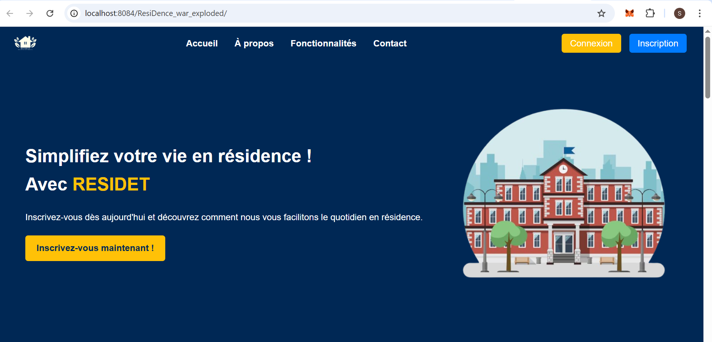

### 🧑‍💼 Admins
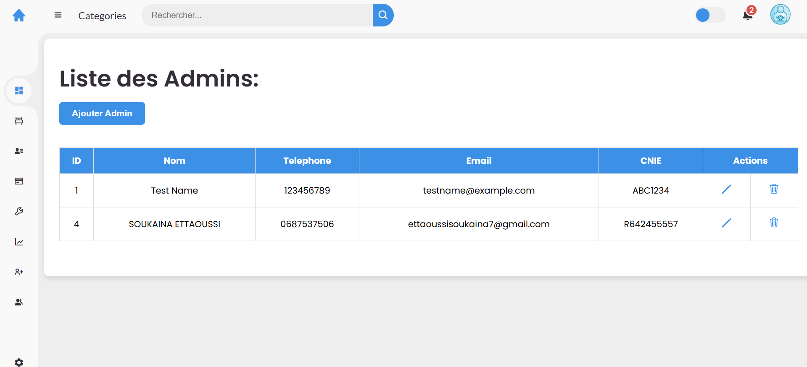

### ➕ Ajout Résident


### 🛏️ Chambre
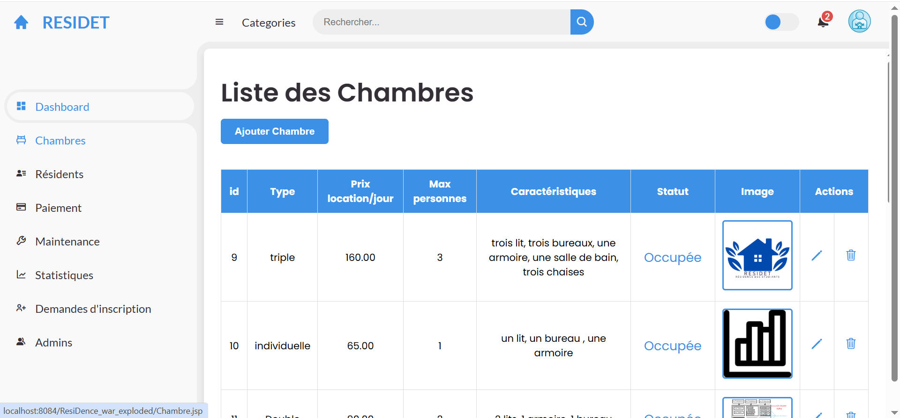

### 🔐 Changement mot de passe
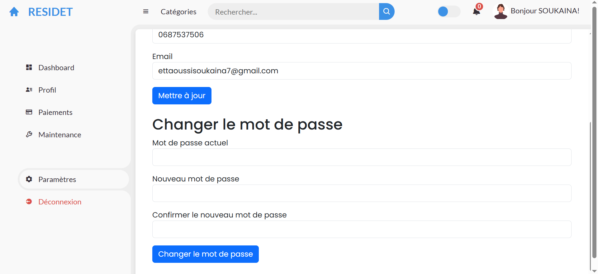

### ✔️ Confirmation d’inscription
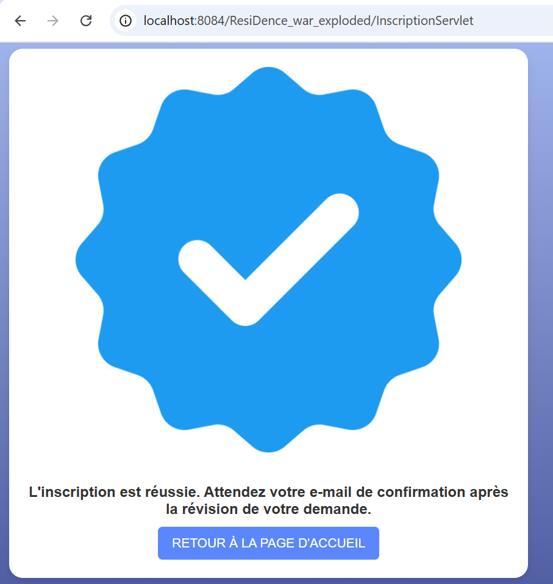

### 🔑 Connexion
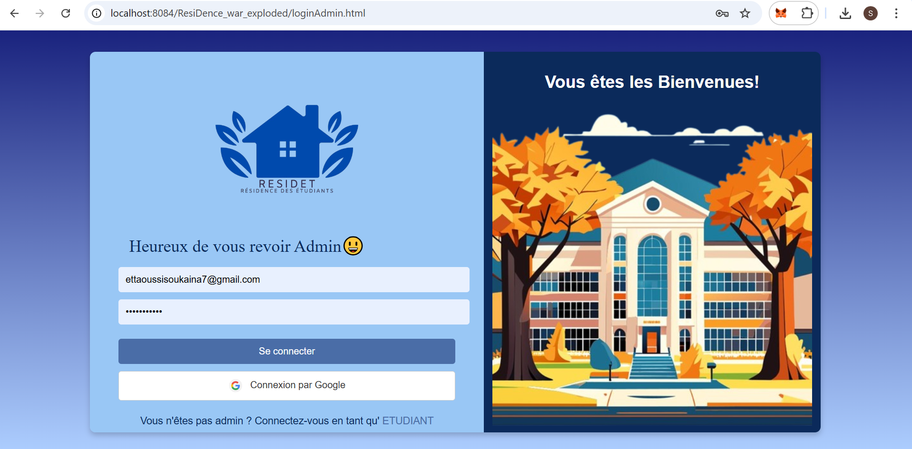

### 📊 Dashboard Admin
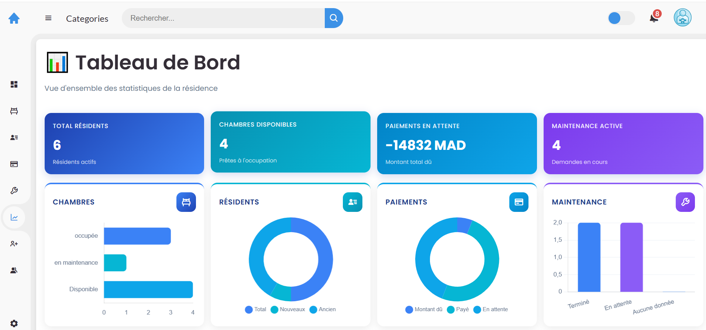

### 📊 Dashboard Résident
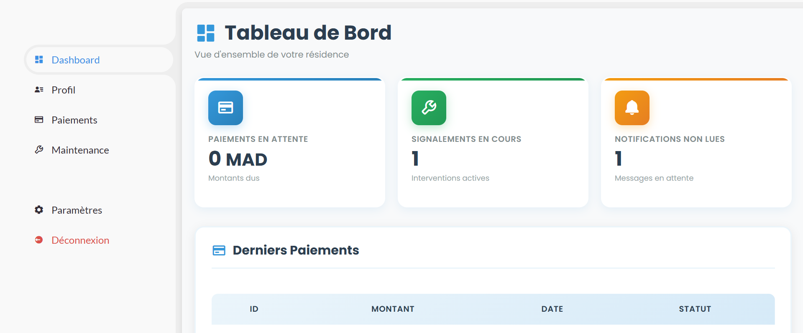

### 📝 Demande d’Inscription
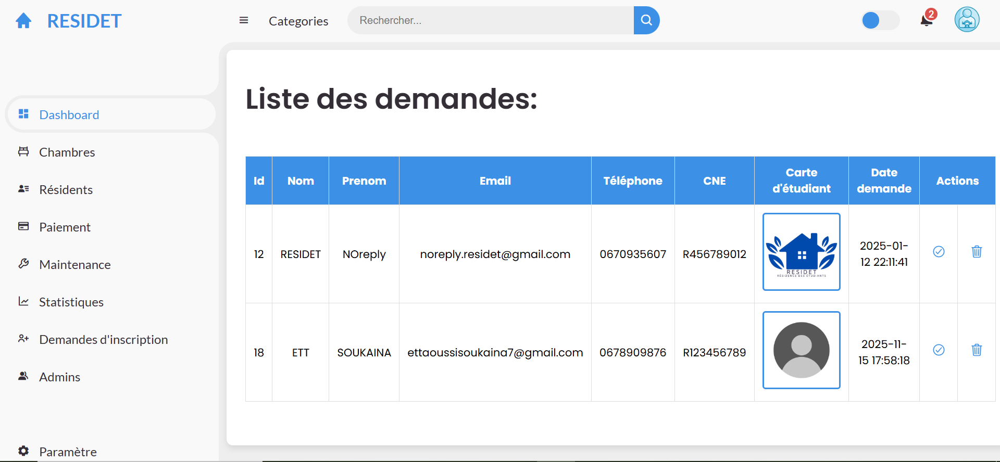

### 🛠️ Formulaire de Modification
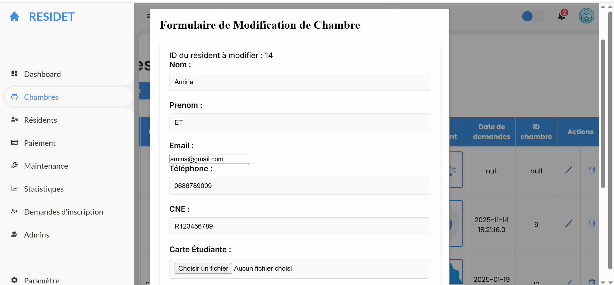

### 🧾 Inscription
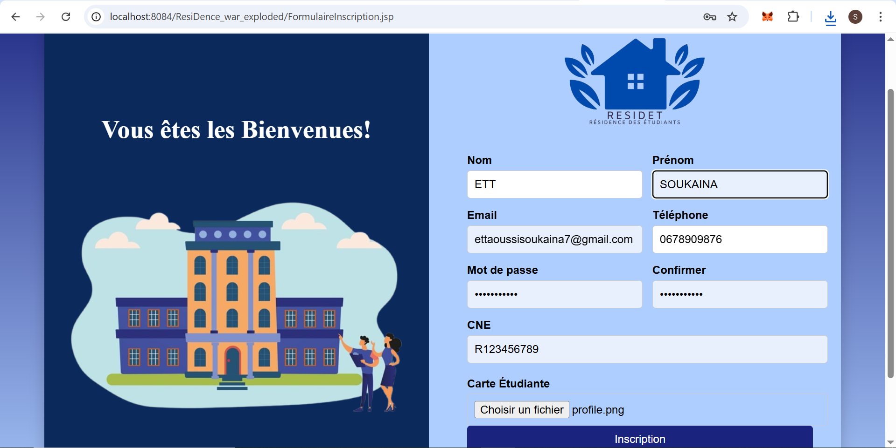

### 🔧 Maintenance (Admin)
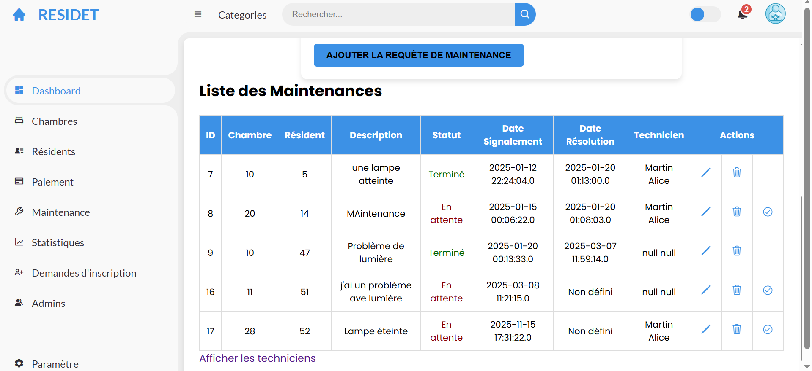

### 🔧 Maintenance (Résident)


### 🔔 Notifications
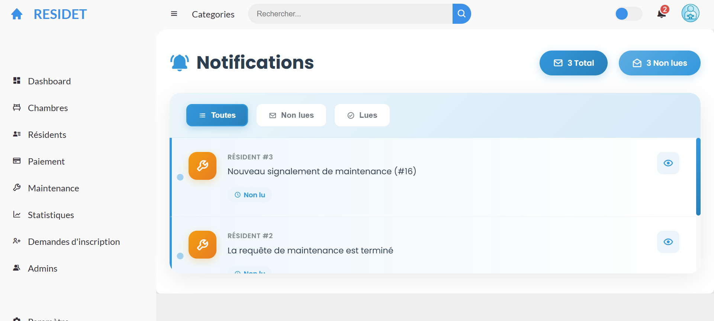

### 💳 Paiement (Admin)
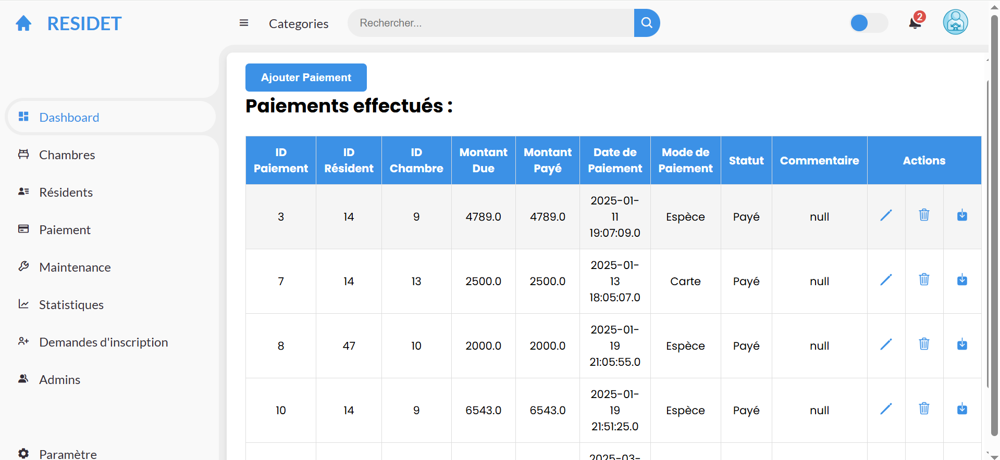

### 💳 Paiement (Résident)
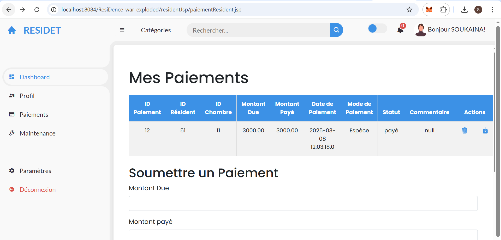

### ⚙️ Paramètres
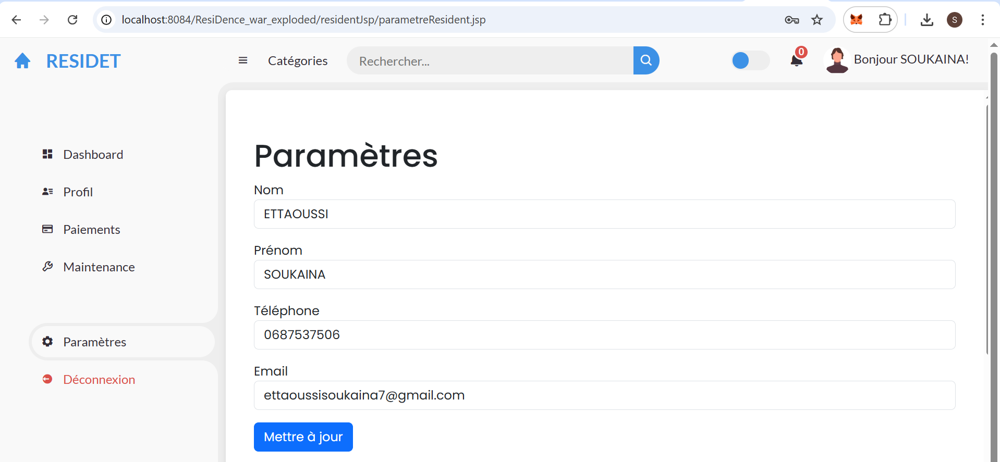

### 👨‍🎓 Profil Résident
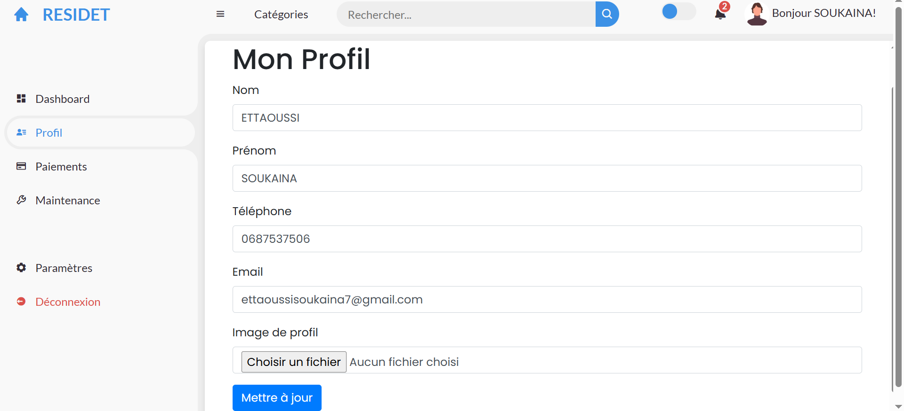

### 🔎 Recherche
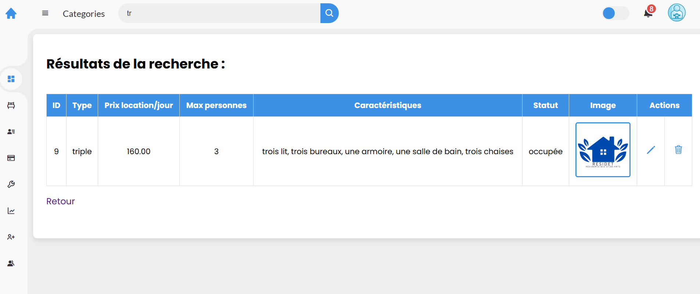

### 🧾 Reçu de Paiement
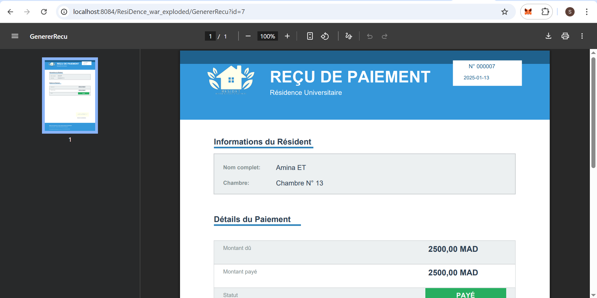
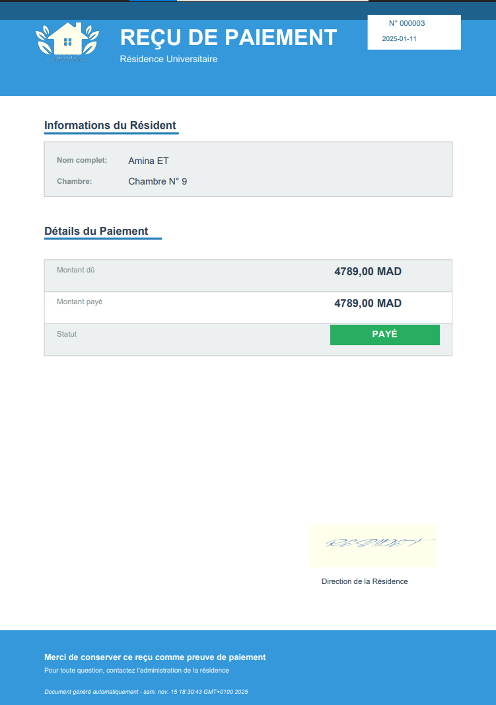

### 📧 Validation Email
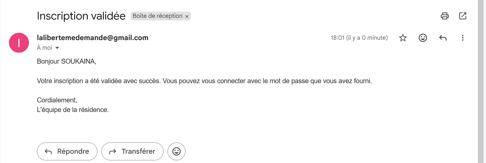


---

## ⚙️ ** Exécution**

### 1️⃣ Compiler & déployer

```bash
mvn clean install
```

Déployer ensuite le `.war` dans **Tomcat**.

### 2️⃣  Accès

```
http://localhost:8080/ResiDence
```


---


